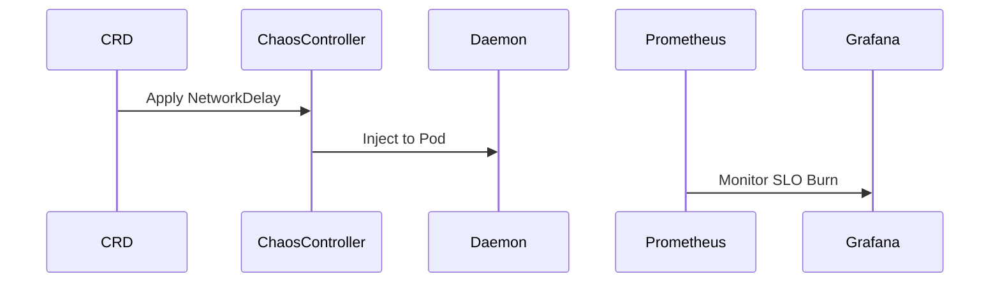

# Architecture: Chaos + SLO Game-Day

## System Diagram
The following Mermaid.js sequence diagram maps the core workflow and interactions:

## SLO Framework
### SLIs (Service Level Indicators)
- **Availability SLI**: Ratio of successful HTTP responses (2xx) to total requests
- **Latency SLI**: P99 request duration

### SLOs (Service Level Objectives)
- **Availability**: 99.9% over a 30-day rolling window
- **Latency**: P99 < 500ms

### Error Budget
Error budget = `1 - ((1 - actual_availability) / (1 - target_availability))`.
When the error budget drops below 25%, an alert fires telling the team to stop feature work and focus on reliability.

## Chaos Experiments
Three experiment types cover the most common failure modes:
1. **Pod Kill**: Validates that the Deployment's replicas and readiness probes ensure zero-downtime recovery
2. **Network Delay**: Validates that the service degrades gracefully under latency (circuit breakers, timeouts)
3. **CPU Stress**: Validates resource limits and HPA (Horizontal Pod Autoscaler) behavior

## Game-Day Workflow
1. Deploy the target app and monitoring stack
2. Verify baseline SLO metrics on the Grafana dashboard
3. Apply a chaos experiment (e.g., `kubectl apply -f chaos-experiments/pod-kill.yaml`)
4. Observe the error budget on Grafana — does it burn?
5. Document findings and corrective actions
